奶牛猫为什么被称为猫中二哈？

 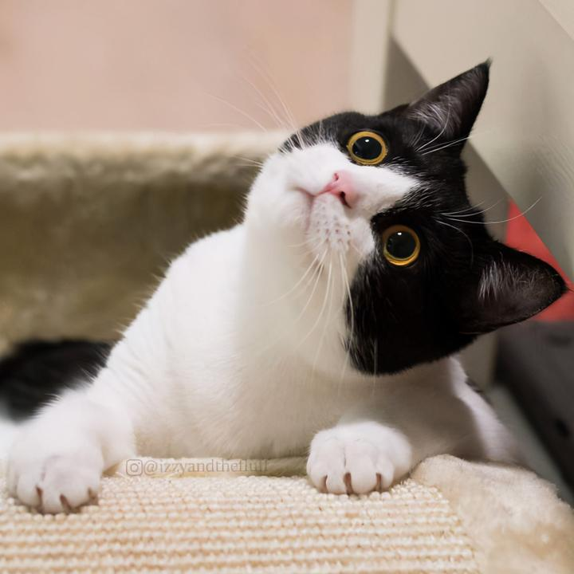 

奶牛猫又称斑马猫，因为它们身上有黑白相间的条纹状图案，看起来像极了斑马的皮毛。这种猫的祖先是英国短毛猫和暹罗猫交配而生的后代，所以它们的性格非常活泼好动，精力旺盛，经常做出一些让人啼笑皆非的举动来吸引主人的注意。那么你知道奶牛猫为什么被称为猫中二哈吗？下面让我们一起来了解一下吧！

一、奶牛猫为什么被称为猫中二哈？

 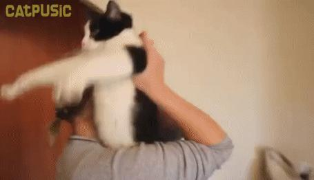 

奶牛猫之所以被人们称为猫中二哈，主要原因有以下几点：

1、喜欢拆家

 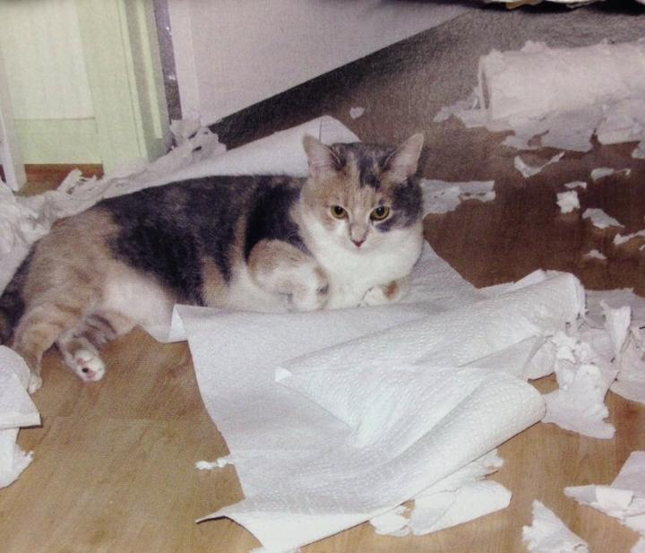 

由于奶牛猫的性格十分活泼好动，而且好奇心极强，因此它们经常会做一些让主人哭笑不得的事情。比如在家里翻箱倒柜，把家里弄得一团糟；又或者趁主人不在家时，偷偷溜进厨房偷吃食物等等。这些行为都会让主人感到头疼不已。

2、调皮捣蛋

 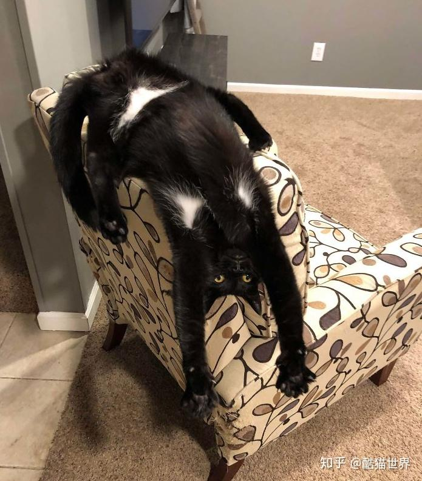 

除了喜欢拆家之外，奶牛猫还特别喜欢捉弄人。比如说当主人坐在沙发上休息时，它会突然跳上去咬住主人的脚丫子不放手；或者在半夜三更的时候跑出来吓唬别人等等。总之只要有机会它就会想办法去惹事生非。

3、聪明伶俐

 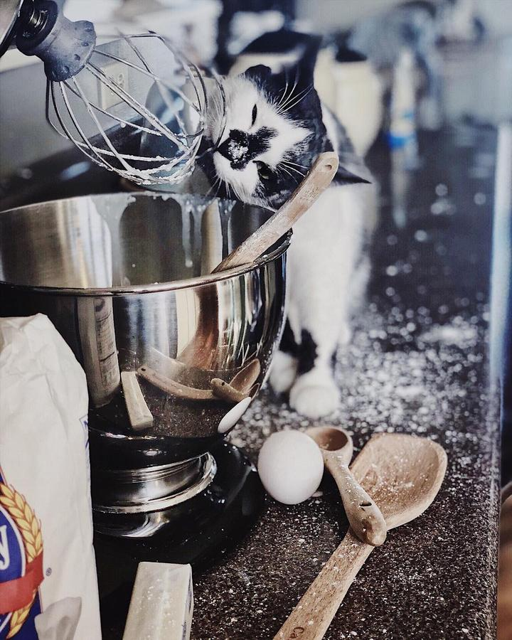 

虽然奶牛猫很调皮捣蛋，但是它的智商却非常高。因为它能够听懂人类语言并做出相应的反应。例如当主人叫它吃饭时，它就会乖乖地走到饭桌前等待开饭；当主人喊它睡觉时，它也会乖乖地爬上床跟着主人一起进入梦乡。由此可见，奶牛猫不仅拥有超高的智商，而且还具备很强的学习能力和适应能力。

二、如何饲养奶牛猫？

 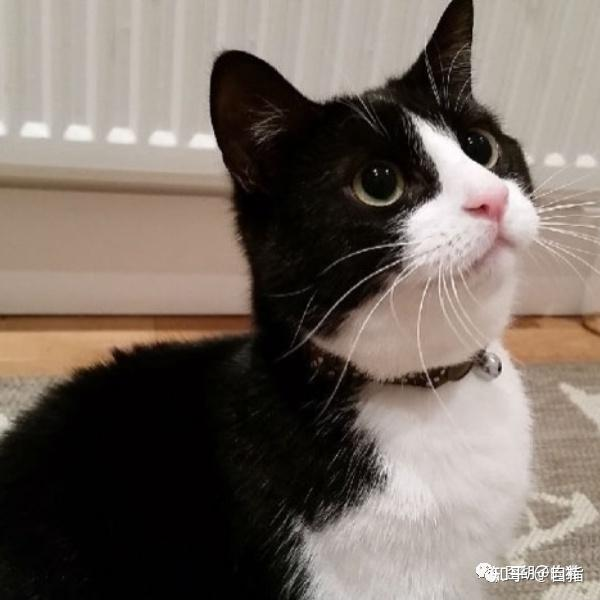 

要想养好一只健康的奶牛猫，需要注意以下几点：

1、提供充足的食物和水源

 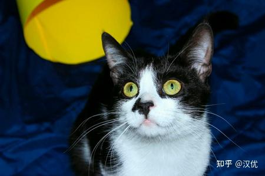 

为了让奶牛猫吃得饱喝得足，主人应该每天定时定量给它喂食。同时还要保证水源干净卫生，避免出现腹泻呕吐等现象。

2、定期驱虫打疫苗

 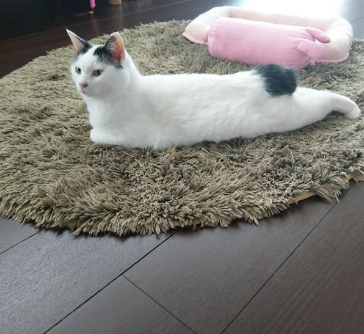 

为了预防疾病发生，建议每隔三个月带奶牛猫去宠物医院进行体内外驱虫以及狂犬病疫苗接种工作。

3、给予足够的运动量

 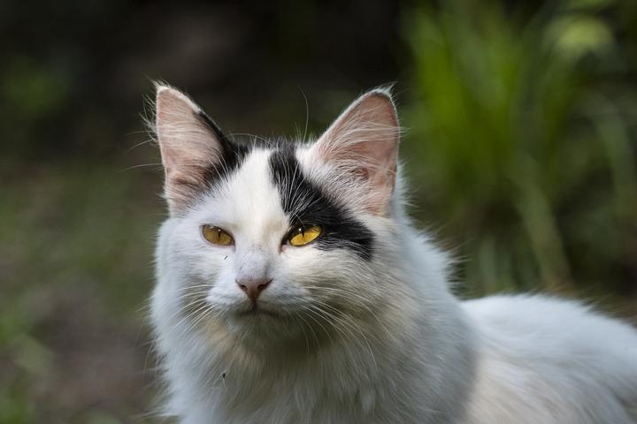 

平时多带奶牛猫到户外活动玩耍，不仅可以锻炼身体增强体质，还能促进感情交流增进彼此友谊。

4、保持室内清洁卫生

 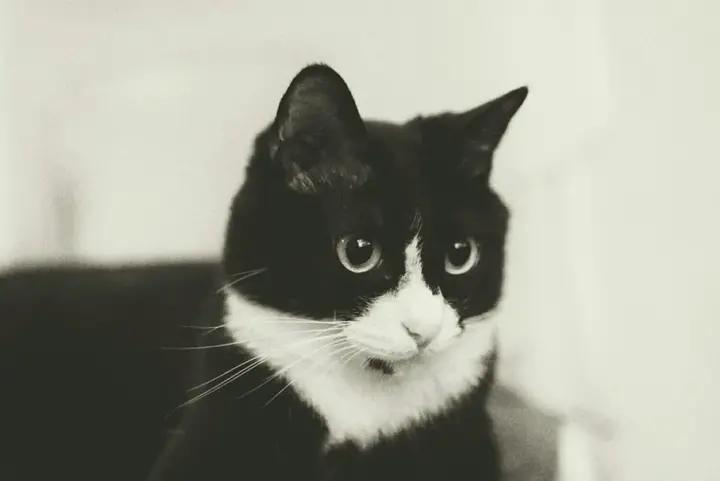 

为了避免细菌滋生引发各种皮肤问题，应定期对家中环境进行大扫除及消毒处理。

5、关注猫咪健康状况

 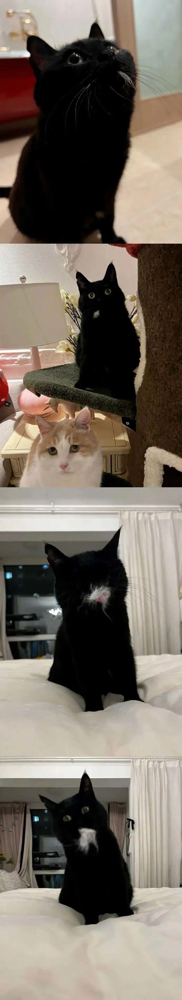 

一旦发现奶牛猫身体不适或有异常表现时，应及时送医诊治以免延误病情造成严重后果。

6、培养良好生活习惯

 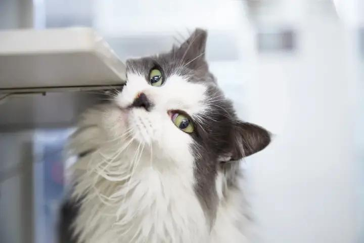 

要让奶牛猫养成良好的生活作息规律，做到早睡早起不熬夜晚起早贪黑玩电脑看手机刷视频打游戏看电视追剧看电影听音乐唱歌跳舞弹琴画画写诗作画绘画书法篆刻陶艺雕塑木雕石雕金属工艺珠宝首饰服装设计美容美发美甲纹绣化妆护肤减肥塑身养生保健按摩推拿针灸拔罐刮痧艾灸火疗水疗汗蒸熏蒸泡澡游泳跑步打球踢足球打篮球打排球打网球打羽毛球打乒乓球打台球打高尔夫球打保龄球打壁球打棒球打垒球打曲棍球打飞镖打射箭打拳击打柔道打跆拳道打空手道打泰拳打自由搏击打散打打咏春拳打太极拳打八段锦打五禽戏打六字真言打易筋经打洗髓功打九阳神功打金钟罩铁布衫打乾坤大挪移打天罡北斗阵打降龙十八掌打葵花点穴手打蛤蟆功打罗汉拳打醉拳打醉剑打醉刀打醉棍打醉枪打醉斧打醉锤打醉戟打醉蛇打醉鹰打醉马打醉猿打醉鹤打醉鸡打醉鹅打醉鸭打醉狗打醉猪打醉羊打醉兔打醉狐打醉狼打醉豹打醉虎打醉熊打醉鹿打醉象打醉龟打醉蟹打醉虾打醉鱼打醉鸟打醉蝶打醉蜻蜓打醉蝴蝶打醉蜜蜂打醉蚂蚁打醉蜘蛛打醉蜈蚣打醉螳螂打醉蚱蜢打醉蝗虫打醉蚊子打醉苍蝇打醉蜗牛打醉蚯蚓打醉蚂蚱打醉蟋蟀打醉蝈蝈打醉蜣螂打醉蝉打醉萤火虫打醉蝙蝠打醉乌鸦打醉鸽子打醉麻雀打醉喜鹊打醉黄鹂打醉杜鹃打醉百灵打醉鹦鹉打醉孔雀打醉鸳鸯打醉白鹭打醉鸿雁打醉